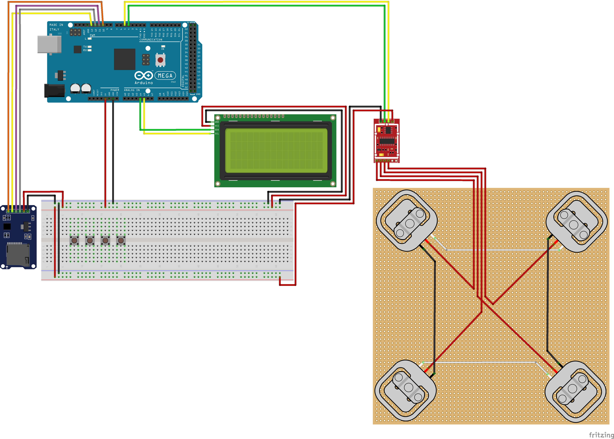

# Control Panel

## Schéma

## Prérequis

Ce système de gestion de camping-car nécessite un `Arduino Mega`.

## Configuration : Contenu de la carte micro SD

La carte micro SD contient la configuration du système ainsi que les fichiers de traduction.

Un example est fournis dans le dossier `templates`.

### Arborescence

- ccds
    - lang
        - en
        - fr
    - config

Le fichier de configuration doit être nommé : `config` (Exemple dans les templates)

Il doit être enregistré sur une carte micro SD, dans un dossier `ccds`.

Cette carte sera ensuite inséré dans le lecteur de carte micro SD du système, avant sa mise en route, afin de configurer celui-ci.

Pour reconfigurer le système, veillez à mettre hors tension le système avant de manipuler la carte SD.

### Liste des paramètres

__Language__

*Valeurs*

    - en
    - fr

*Defaut*

    - en

*Exemple*

    language=fr

__Pourcentage des progress bar__

*Valeurs*

    - true
    - false

*Defaut*

    - true

*Exemple*

    showPercentage=true

## Liste du matériel à prévoir

- 1 x [Arduino Mega 2560 Rev3](https://www.amazon.fr/dp/B0046AMGW0)
- 1 x [Abaisseur de tension DC-DC (12v -> 5V)](https://www.amazon.fr/dp/B08Q3GQQZ7)
- 1 x [Module lecteur de carte micro SD](https://www.amazon.fr/dp/B06X1DX5WS)
- 1 x [Carte micro SD](https://www.amazon.fr/dp/B008RDCC26)
- 1 x [Module Ecran LCD2004 I2C](https://www.amazon.fr/dp/B07QNKCLJM)
